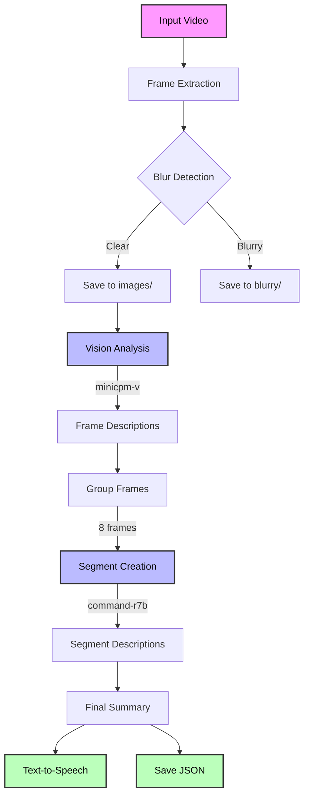

# OSIRIS Video Sage 🎥 🤖

https://youtu.be/-G9M67vvxq4

[](https://www.youtube.com/watch?v=-G9M67vvxq4)

A powerful video analysis tool that uses Ollama's local AI models to provide detailed descriptions of video content.

# Video Analysis with Vision.py

A powerful tool that analyzes videos using AI vision models to create detailed descriptions of video content. The script processes videos frame by frame, analyzes content using vision models, and generates a coherent narrative description with text-to-speech output.

## Features

- Frame extraction and blur detection
- AI-powered video frame analysis using vision models (default: minicpm-v)
- Intelligent frame sampling to reduce processing time
- Segment-based video description generation
- Text-to-speech narration of final description
- Detailed progress tracking and status updates
- JSON output of all analysis results

## Process Overview



## Requirements

### System Dependencies
```bash
# macOS
brew install portaudio

# Ubuntu/Debian
sudo apt-get install python3-pyaudio portaudio19-dev
```

### Python Dependencies
```bash
pip install opencv-python numpy ollama edge-tts tqdm
```

### AI Models
Ensure Ollama is installed and the following models are available:
```bash
ollama pull minicpm-v:latest  # for vision analysis
ollama pull command-r7b:latest  # for text processing
```

## Usage

Simply place your video file in the same directory as `vision.py` and run:
```bash
python vision.py your_video.mp4
```

For example:
```bash
python vision.py birthday_party.mp4
```

## Output Structure

The script creates an `analysis_output` directory next to your video file containing:

```
analysis_output/
├── images/              # Clear frames extracted from video
├── blurry/              # Frames detected as blurry
└── analysis_results.json  # Complete analysis results
```

The JSON output includes:
- Video metadata and parameters
- Individual frame descriptions
- Segment descriptions
- Final video summary

## Configuration

All settings are centralized in the `config` dictionary in `vision.py`. Key parameters include:

### Video Processing
```python
"fps_sample_rate": 5,    # Analyze 1 frame every 5 seconds
"batch_size": 8,         # Combine 8 frames per segment
"blur_threshold": 4,     # Blur detection sensitivity
```

### AI Models
```python
"vision_model": "minicpm-v:latest",  # Model for analyzing frames
"text_model": "command-r7b:latest",  # Model for combining descriptions
```

### Prompts
You can customize the prompts used for:
- Frame analysis
- Segment description generation
- Final video summary

## Process Flow

1. **Frame Extraction**
   - Samples frames at specified intervals
   - Detects and filters blurry frames
   - Saves frames to organized directories

2. **Frame Analysis**
   - Processes each frame with the vision model
   - Generates detailed descriptions of frame content
   - Tracks progress with status bars

3. **Segment Creation**
   - Combines frame descriptions into coherent segments
   - Maintains temporal context and progression
   - Groups related frames for better narrative flow

4. **Final Description**
   - Combines segment descriptions into a complete narrative
   - Generates a concise, coherent video summary
   - Converts summary to speech using edge-tts

## Performance Tips

- For longer videos:
  - Increase `fps_sample_rate` to analyze fewer frames
  - Increase `batch_size` to create fewer segments
- For detailed analysis:
  - Decrease `fps_sample_rate` to analyze more frames
  - Decrease `batch_size` for more granular segments
- For blur detection:
  - Adjust `blur_threshold` (default: 4)
  - Lower values = more sensitive to blur

## Limitations

- Processing time depends on video length and sampling rate
- Requires sufficient disk space for frame storage
- GPU recommended for faster processing
- Internet connection required for AI model inference
- Models must be available in Ollama

## Troubleshooting

If you encounter issues:
1. Ensure all dependencies are installed
2. Verify the video file exists in the same directory as `vision.py`
3. Check that required AI models are available in Ollama
4. Ensure you have sufficient disk space for frame storage
5. Check your internet connection for model access 
